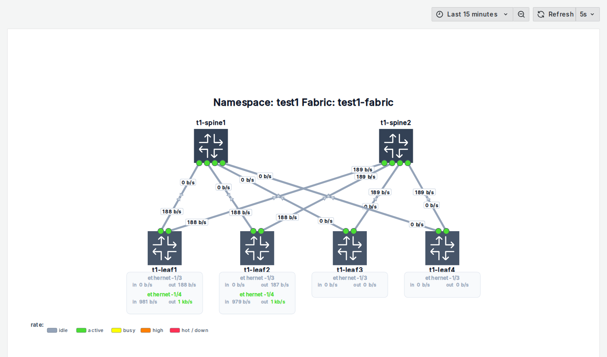
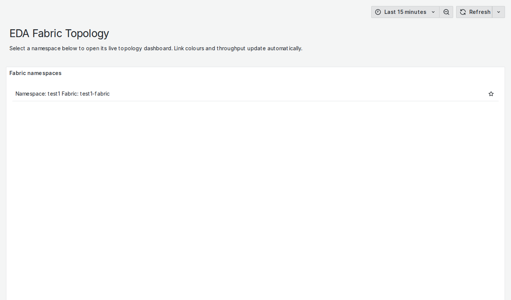
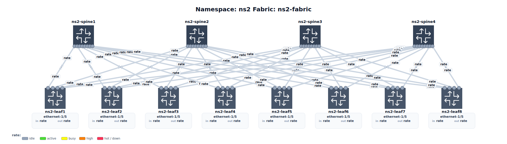

# EDA TopoView — auto-generated Grafana topology dashboards for Nokia EDA

**TopoView** is a [Nokia EDA](https://docs.eda.dev/) application that turns any EDA-managed
data-center fabric into a live Grafana **topology map** — automatically. Install it once, and it
discovers every namespace that contains a fabric, draws the switch topology, wires up live
per-interface telemetry, and keeps the dashboards in sync as the topology changes. No dashboards to
hand-build, no SVG to hand-edit.



---

## What it does

- **Auto-discovers fabrics.** Every ~30 s it lists `TopoNode` / `TopoLink` (and cross-checks the
  `Fabric` CR) across all namespaces and builds one dashboard per fabric.
- **Draws the fabric by role.** Border-leaf switches on the **top** row, spines in the **middle**,
  leaf switches on the **bottom** — roles come from the `eda.nokia.com/role` node label (or the
  Fabric CR's selectors). Rows that are empty collapse; the canvas auto-scales to any fabric size.
- **Live link telemetry.** Every inter-switch link is a dual-direction arrow coloured by throughput,
  with a live bits/sec pill per direction, plus a port dot coloured by oper-state (green up / red
  down). Values refresh every ~5 s straight from Prometheus.
- **Edge interfaces, not host clutter.** Host-facing ports aren't drawn as nodes — instead each leaf
  lists its edge interfaces (`ethernet-1/3`, `ethernet-1/4`, …) with live in/out bps, the interface
  name coloured by rate.
- **Read-only, no login.** Users land straight on a menu, pick a fabric, and view it. Grafana is
  anonymous read-only behind EDA's own authenticated proxy.
- **Self-healing & change-aware.** Dashboards are re-generated only when a fabric's *structure*
  changes (add/remove/re-cable a node), and re-pushed automatically if Grafana restarts.

| Menu (pick a fabric) | Scales to large fabrics (4 spine × 8 leaf) |
|---|---|
|  |  |

---

## How it works

TopoView bundles its own telemetry stack (Prometheus + Grafana — **no Loki**, since EDA has native
logging) plus a small Python controller. Everything installs into an `eda-topoview` namespace.

```
                         eda-topoview namespace
  ┌──────────────────────────────────────────────────────────────────┐
  │  TopoView controller (Deployment)                                 │
  │    every 30s: read TopoNode/TopoLink/Fabric  →  build model       │
  │               →  auto-layout  →  render SVG + flow-panel config    │
  │               →  push dashboard to Grafana (admin API)            │
  │                                                                    │
  │  Prometheus  ── scrapes ──►  EDA prometheus-exporter endpoint      │
  │       ▲                       (node_srl_interface_* metrics)       │
  │       │ query                                                      │
  │  Grafana (anonymous read-only, andrewbmchugh-flow-panel plugin)    │
  └──────────────────────────────────────────────────────────────────┘
                    ▲
        EDA HttpProxy  →  https://<your-eda-host>/core/httpproxy/v1/grafana/
```

- The controller reads the cluster via its **ServiceAccount token** only (no Keycloak / EDA REST).
- Metrics come from two ns-agnostic **`Export` CRs** (`node_srl_interface_oper_state` and
  `node_srl_interface_traffic_rate_{in,out}_bps`) that cover every namespace at once.
- The topology map is an [`andrewbmchugh-flow-panel`](https://github.com/andrewbmchugh/flow) panel;
  the controller generates its SVG and `panelConfig` from the live topology.

---

## What's in this repo

```
PROJECT                         edabuilder project descriptor
topoview/
  manifest.yaml                 EDA app manifest (CRD + ordered cr: components)
  api/v1alpha1/                 Go types for the TopoViewConfig CRD
  crds/  openapiv3/             generated CRD + OpenAPI schema
  build/
    Dockerfile                  controller image
    controller/                 the controller (Python, stdlib only)
      main.py                   reconcile loop + namespace discovery
      topology.py               CRs  → vendor-neutral topology model
      layout.py                 model → auto-layout (role rows, crossing-min, port fan-out)
      svggen.py                 layout → SVG + flow-panel panelConfig
      dashboard.py              flow-panel dashboard + menu dashboard JSON
      grafana.py  k8s.py        Grafana API + Kubernetes API clients
  docs/                         Store app page (index.md, README, CHANGELOG, …)
  manifests/                    bundled stack, deployed into eda-system
    01-grafana-secret 10/11-prometheus 20/21-grafana
    40-grafana-httpproxy app_deployment rbac
    30-exports.yaml             (NOT a bundle component — the controller creates
                                 these Export CRs at runtime; kept here for reference)
examples/localtest/             offline generator harness + synthetic fabric fixtures
```

---

## Install

Prerequisite: a Nokia EDA cluster (tested on **26.4.3**) with the `prom.eda.nokia.com` exporter app
(installed automatically as a dependency). Everything installs into the `eda-system` namespace.

### From the EDA Store (recommended)

Published in the [kkayhan/eda-catalog](https://github.com/kkayhan/eda-catalog) catalog. Register the
catalog, then install:

```yaml
# catalog.yaml
apiVersion: appstore.eda.nokia.com/v1
kind: Catalog
metadata: { name: kkayhan-catalog, namespace: eda-system }
spec:
  enabled: true
  remoteType: git
  remoteURL: https://github.com/kkayhan/eda-catalog.git
  refreshInterval: 180
  title: kkayhan community catalog
```

```bash
kubectl apply -f catalog.yaml
```

TopoView then appears in the EDA UI **Store** (or install headlessly with an `AppInstaller` CR for
`appId: topoview.eda.edacommunity.com`, `catalog: kkayhan-catalog`).

### Manual deploy (dev)

```bash
kubectl apply -f topoview/crds/
kubectl apply -f topoview/manifests/          # all land in eda-system
```

**Set two placeholders first** for a manual deploy (the Store bundle bakes working values):

1. `topoview/manifests/21-grafana.yaml` → `GF_SERVER_ROOT_URL`: replace `YOUR-EDA-HOST` with the
   address you open the EDA UI at.
2. `topoview/manifests/01-grafana-secret.yaml` → set a real `admin-password` (placeholder shipped;
   it only protects the controller's write path — humans are anonymous read-only).

The controller creates the two `Export` CRs (`30-exports.yaml`) itself, so you don't apply those.

### Open it

`https://<your-eda-host>/core/httpproxy/v1/grafana/?kiosk` — land on the menu, pick a fabric, done.
(`?kiosk` hides Grafana's own chrome; it stays hidden as you navigate.)

---

## Configuration — `TopoViewConfig` (cluster-scoped singleton)

You normally don't need to touch it — auto-discovery drives everything. It exists for global tuning
and status. All spec fields are optional:

| Field | Default | Purpose |
|---|---|---|
| `namespaceExclude` | `[]` | namespaces to skip |
| `refresh` | `5s` | dashboard refresh interval |
| `roleTiers` | `{borderleaf:0, superspine:0, spine:1, leaf:2}` | role → row |
| `thresholds` | built-in | traffic + oper-state colour thresholds |
| `prometheusDatasourceUid` | `PBFA97CFB590B2093` | Grafana datasource uid |

`status` reports discovered namespaces, per-fabric dashboard uids + structure hashes, and health.

---

## Notes

- **Metrics are SR Linux (`node_srl_*`).** All-SRL fabrics today; SR OS / multi-vendor is future work.
- **Bundled Grafana is ephemeral** (no PVC). API-pushed dashboards are re-pushed on restart by the
  controller (self-heal, ≤30 s); the menu is provisioned from a file.
- Roles resolve from the `eda.nokia.com/role` label first, then the `Fabric` CR selectors.

## License

MIT — see [LICENSE](LICENSE).
